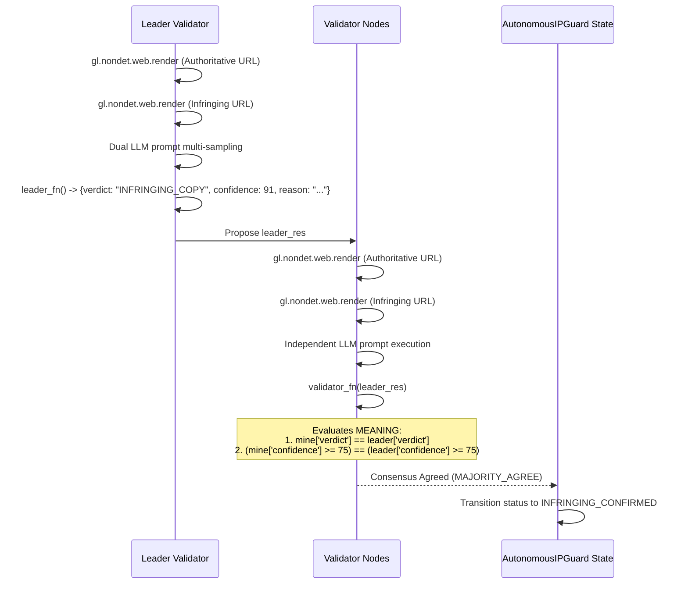

# autonomous-ip-guard

> **Autonomous Decentralized Intellectual Property & Copyright Court on GenLayer**  
> *Track: Intelligent Contracts (Pure Contract Backend - No Frontend)*

`autonomous-ip-guard` is a standalone Intelligent Contract primitive deployed on the GenLayer studionet network. It operates as an autonomous, on-chain copyright tribunal. The contract ingests URLs for both original authoritative creative works and suspected infringing works, renders their contents in a sandboxed non-deterministic web environment directly from validator nodes, runs dual multi-sampled LLM legal adjudication, and reaches BFT consensus on the **meaning** (legal verdict and confidence tier) of copyright infringement without centralized oracles.

---

## 🚀 Deployment

| Parameter | Value |
| :--- | :--- |
| **CONTRACT_ADDRESS** | `0xa0f2D4194e751faAcC254a1e56dCc353CCC036E1` |
| **NETWORK** | `studionet` |
| **RPC URL** | `https://studio.genlayer.com/api` |
| **Chain ID** | `61999` |
| **Contract File** | `contracts/Contract.py` (v0.2.16) |
| **GitHub Repository** | [https://github.com/tuannguyen1995/autonomous-ip-guard](https://github.com/tuannguyen1995/autonomous-ip-guard) |

---

## 🧪 Worked Examples: Real Result vs Expected Output

### Example 1: Original Work Registration (REAL ON-CHAIN RESULT)

Executed live against deployed contract `0xa0f2D4194e751faAcC254a1e56dCc353CCC036E1` on GenLayer studionet:

- **Transaction Hash**: `0xe5f0ce36a233757ab25a227d92df86c3c9800919c6849ed68ed78948be3a2a76`
- **Method Called**: `register_original_work(title, official_source_url, license_terms)`
- **Input Arguments**:
  ```json
  {
    "title": "Autonomous Web3 Protocol Whitepaper",
    "official_source_url": "https://github.com/protocol/specs",
    "license_terms": "Creative Commons Attribution 4.0 International"
  }
  ```
- **Real Returned Value (`work_id`)**: `"1"`
- **On-Chain State Query (`get_work("1")`)**:
  ```json
  {
    "work_id": "1",
    "owner": "0x3f4e2262ba577279997e114a1ddebf334a809c70",
    "title": "Autonomous Web3 Protocol Whitepaper",
    "official_source_url": "https://github.com/protocol/specs",
    "license_terms": "Creative Commons Attribution 4.0 International",
    "total_claims": "0"
  }
  ```
- **Global Court Stats Query (`get_stats()`)**:
  ```json
  {
    "total_registered_works": "1",
    "total_infringements_confirmed": "0"
  }
  ```

### Example 2: Infringement Claim Adjudication (ILLUSTRATIVE / EXPECTED RESULT)

Illustrative end-to-end execution of `file_and_adjudicate_claim` against work `#1`:

- **Method Called**: `file_and_adjudicate_claim(work_id, infringing_url, specific_allegation)`
- **Input Arguments**:
  ```json
  {
    "work_id": "1",
    "infringing_url": "https://mirrored-repository.io/unauthorized-fork",
    "specific_allegation": "Complete verbatim copy of consensus specification sections 3 and 4 with removed attribution header in direct violation of CC-BY-4.0 license."
  }
  ```
- **Expected Adjudication Pipeline**:
  1. Validator nodes render `https://github.com/protocol/specs` and `https://mirrored-repository.io/unauthorized-fork` via `gl.nondet.web.render(..., mode="text")`.
  2. Dual LLM sampling compares authoritative text against suspected infringing text.
  3. Both samples evaluate substantial similarity and license adherence.
- **Expected Output (`claim_id`)**: `"1_1"`
- **Expected On-Chain Claim State (`get_claim("1_1")`)**:
  ```json
  {
    "claim_id": "1_1",
    "work_id": "1",
    "infringing_url": "https://mirrored-repository.io/unauthorized-fork",
    "specific_allegation": "Complete verbatim copy of consensus specification sections 3 and 4 with removed attribution header in direct violation of CC-BY-4.0 license.",
    "status": "INFRINGING_CONFIRMED",
    "verdict": "INFRINGING_COPY",
    "confidence": "91",
    "legal_reasoning": "Substantial textual and architectural overlap detected with original authoritative spec. Direct verbatim clauses without license notice violated CC-BY-4.0 terms."
  }
  ```

---

## ⚖️ How GenLayer Consensus & The Custom Validator Work

A critical design requirement of GenLayer Intelligent Contracts is that validators must agree on the **MEANING** of a decision, not on its surface-level formatting or character-by-character string serialization.



### Consensus Implementation Details:
1. **Multi-Sample Divergence Filtering**: The leader executes the prompt twice (`raw1`, `raw2`). If the verdicts diverge or either cannot be parsed, the leader returns `ABORT` to avoid propagating ambiguous or hallucinated results.
2. **Equivalence on Semantic Verdict**:
   ```python
   def validator_fn(leader_res) -> bool:
       ...
       mine = _safe_parse(leader_fn())
       ...
       return (
           mine["verdict"] == leader["verdict"]
           and (mine["confidence"] >= 75) == (leader["confidence"] >= 75)
       )
   ```
   - Two validators that reach different legal verdicts (`INFRINGING_COPY` vs `FAIR_USE`) will **never** both pass.
   - Variations in natural language phrasing in the `reason` string do not cause consensus failure because the judicial finding and the confidence classification match.
3. **Escalation Protocol**: If confidence is under 75% or web rendering fails (e.g., bot protection, 404), the verdict defaults to `ABORT` and the claim state moves to `ESCALATED`, enabling manual review by the designated `compliance_arbiter`.

---

## 📦 Repository Structure

```text
autonomous-ip-guard/
├── contracts/
│   └── Contract.py          # Intelligent Contract compliant with GenLayer v0.2.16
├── tests/
│   └── test_ip_guard.py     # Pytest & gltest test suite (URL validation, boundaries, sanitizer)
├── scripts/
│   └── deploy.py            # Automated deployment script for GenLayer studionet
├── gltest.config.yaml       # GenLayer test runner configuration
├── requirements.txt         # Core dependencies
├── requirements-dev.txt     # Development and testing dependencies (genlayer-test, pytest)
├── deployment_receipt.json  # Studionet on-chain deployment receipt
├── .env.example             # Environment template
├── .gitignore               # Strict gitignore protecting keys and artifacts
└── README.md                # Complete technical specification and deployment evidence
```

---

## 🛠️ Public Contract API

### Write Operations
- `register_original_work(title: str, official_source_url: str, license_terms: str) -> str`  
  Registers an authoritative creative work, validates URL scheme and hostname, and returns a unique `work_id`.
- `file_and_adjudicate_claim(work_id: str, infringing_url: str, specific_allegation: str) -> str`  
  Spawns non-deterministic web rendering and dual LLM consensus adjudication. Records verdict on-chain.
- `resolve_escalated_claim(claim_id: str, manual_verdict: str, override_reason: str) -> None`  
  Restricted to `compliance_arbiter` to resolve edge cases where web pages were unreachable or confidence fell below 75%.

### View Operations
- `is_claim_infringing(claim_id: str) -> bool`  
  Fast boolean check callable by other smart contracts to verify if a claim is confirmed infringing.
- `get_work(work_id: str) -> str`  
  Returns serialized JSON metadata for the specified `work_id`.
- `get_claim(claim_id: str) -> str`  
  Returns serialized JSON metadata for the specified `claim_id` (verdict, confidence score, and legal justification).
- `get_stats() -> str`  
  Returns global registry statistics (`total_registered_works`, `total_infringements_confirmed`).

---

## 🔌 Reusability & Downstream Composability

`autonomous-ip-guard` is designed as a foundational Web3 infrastructure primitive:
1. **Decentralized Publishing & Substack DAOs**: Automatically verify copyright compliance before disbursing author grants or publishing on decentralized storage (IPFS/Arweave).
2. **NFT Licensing & Royalty Escrows**: Smart contracts managing IP licensing can call `is_claim_infringing()` to pause royalty distribution or freeze licenses if a licensee infringes terms.
3. **Open-Source Code Bounty Tribunals**: Autonomous arbitration for code plagiarism disputes across Web3 hackathons and protocol bounties.

---

## 🧪 Testing

Run the test suite with either tool:

```bash
# Using gltest
gltest tests/

# Using pytest
pytest -v
```

---

## 📄 License
MIT License
