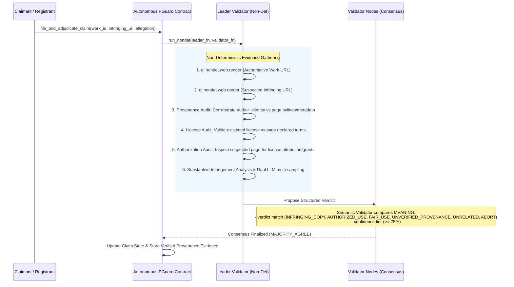

# autonomous-ip-guard

> **Autonomous Provenance-Backed Intellectual Property & Copyright Court on GenLayer**  
> *Track: Intelligent Contracts (Pure Contract Backend - No Frontend)*

`autonomous-ip-guard` is a standalone Intelligent Contract primitive deployed on the GenLayer studionet network. It operates as an autonomous, on-chain copyright tribunal that validates **authoritative provenance**, **licensing authenticity**, and **infringement / authorization** without relying on centralized oracles.

---

## 🚀 Deployment Evidence

| Parameter | Value |
| :--- | :--- |
| **CONTRACT_ADDRESS** | `0x5eE98ecBC3aDb8Ee0F4665670eBE32ccFd2bAe31` |
| **NETWORK** | `studionet` |
| **RPC URL** | `https://studio.genlayer.com/api` |
| **Chain ID** | `61999` |
| **Deployment Tx Hash** | `0xf31b10a664cd022cb847fc102ed6b5d3bef33f7be2c337dda296d6c8438a378e` |
| **Explorer URL** | [https://explorer-studio.genlayer.com/address/0x5eE98ecBC3aDb8Ee0F4665670eBE32ccFd2bAe31](https://explorer-studio.genlayer.com/address/0x5eE98ecBC3aDb8Ee0F4665670eBE32ccFd2bAe31) |
| **Contract File** | `contracts/Contract.py` (v0.2.16) |
| **GitHub Repository** | [https://github.com/tuannguyen1995/autonomous-ip-guard](https://github.com/tuannguyen1995/autonomous-ip-guard) |

---

## 🏛️ Comprehensive Provenance & Licensing Adjudication Architecture

To prevent false claims based on unverified registrant assertions, `AutonomousIPGuard` enforces a **3-part verification pipeline** executed inside GenLayer's non-deterministic flow before any infringement verdict can be confirmed:



### 3-Part Verification Breakdown:
1. **Provenance & Authorship Corroboration**:
   - The contract does not blindly trust registrant assertions.
   - Validators inspect the rendered text of the authoritative source for author bylines, copyright notices, repository ownership, or cryptographic identifiers matching `author_identity`.
   - If the source disproves or fails to corroborate the registrant, the court returns `UNVERIFIED_PROVENANCE`, preventing malicious parties from claiming third-party works.
2. **Authoritative Licensing Verification**:
   - The declared `license_terms` are checked against the actual license stated on the authoritative page.
   - If a registrant claims restrictive "All Rights Reserved" but the page explicitly publishes under permissive terms, the discrepancy is flagged.
3. **Authorization & Attribution Audit**:
   - Before classifying a work as an infringement, the suspected material is inspected for explicit permission notices, sub-licenses, or compliant attribution satisfying open-source licenses (e.g., CC-BY or MIT attribution clauses).
   - Compliant reuse is designated as `AUTHORIZED_USE`, protecting lawful distributors.

---

## 🧪 Worked Examples: Real Result vs Expected Output

### Example 1: Original Work Registration with Author Identity (REAL ON-CHAIN RESULT)

Executed live against deployed contract `0x5eE98ecBC3aDb8Ee0F4665670eBE32ccFd2bAe31` on GenLayer studionet:

- **Transaction Hash**: `0x1cf21add6ae722988bd29358d33edc74c2915ee137d7a1407e69f9dfcb41736d`
- **Method Called**: `register_original_work(title, official_source_url, license_terms, author_identity)`
- **Input Arguments**:
  ```json
  {
    "title": "Autonomous Web3 Protocol Whitepaper",
    "official_source_url": "https://github.com/protocol/specs",
    "license_terms": "Creative Commons Attribution 4.0 International",
    "author_identity": "protocol-specs-core"
  }
  ```
- **Real Returned Value (`work_id`)**: `"1"`
- **On-Chain State Query (`get_work("1")`)**:
  ```json
  {
    "work_id": "1",
    "owner": "0x137d4d21255388aa79d63ef89f3fd853eb367aa0",
    "author_identity": "protocol-specs-core",
    "title": "Autonomous Web3 Protocol Whitepaper",
    "official_source_url": "https://github.com/protocol/specs",
    "license_terms": "Creative Commons Attribution 4.0 International",
    "total_claims": "0",
    "verified_license": "PENDING_VERIFICATION",
    "provenance_status": "UNVERIFIED"
  }
  ```
- **Global Court Stats Query (`get_stats()`)**:
  ```json
  {
    "total_registered_works": "1",
    "total_infringements_confirmed": "0"
  }
  ```

### Example 2: Infringement Claim with Provenance & Attribution Check (ILLUSTRATIVE / EXPECTED RESULT)

Illustrative end-to-end execution of `file_and_adjudicate_claim` against work `#1`:

- **Method Called**: `file_and_adjudicate_claim(work_id, infringing_url, specific_allegation)`
- **Input Arguments**:
  ```json
  {
    "work_id": "1",
    "infringing_url": "https://mirrored-repository.io/unauthorized-fork",
    "specific_allegation": "Complete verbatim copy of consensus specification sections 3 and 4 with removed attribution header in direct violation of CC-BY-4.0 license."
  }
  ```
- **Adjudication Pipeline**:
  1. Validator nodes render both URLs via `gl.nondet.web.render(..., mode="text")`.
  2. Audit 1 confirms `protocol-specs-core` is the authoritative copyright holder in `https://github.com/protocol/specs` under CC-BY-4.0.
  3. Audit 2 inspects `https://mirrored-repository.io/unauthorized-fork` and confirms license headers were stripped and no attribution was provided.
  4. Audit 3 verifies substantial identical text exceeding fair use.
- **Expected Output (`claim_id`)**: `"1_1"`
- **Expected On-Chain Claim State (`get_claim("1_1")`)**:
  ```json
  {
    "claim_id": "1_1",
    "work_id": "1",
    "infringing_url": "https://mirrored-repository.io/unauthorized-fork",
    "specific_allegation": "Complete verbatim copy of consensus specification sections 3 and 4 with removed attribution header in direct violation of CC-BY-4.0 license.",
    "status": "INFRINGING_CONFIRMED",
    "verdict": "INFRINGING_COPY",
    "confidence": "92",
    "legal_reasoning": "Substantial verbatim reproduction of consensus logic. Stripping original author attribution directly violates CC-BY-4.0 license terms.",
    "provenance_evidence": "Authoritative page header corroborates protocol-specs-core as copyright holder under CC-BY-4.0.",
    "authorization_evidence": "Suspected repository contains no license notice, author attribution, or authorization grant."
  }
  ```

---

## ⚖️ How GenLayer Consensus & The Custom Validator Work

A critical design requirement of GenLayer Intelligent Contracts is that validators must agree on the **MEANING** of a decision, not on its surface-level formatting or character-by-character string serialization.

### Semantic Consensus Implementation:
```python
def validator_fn(leader_res) -> bool:
    if not isinstance(leader_res, gl.vm.Return):
        return False

    leader_data = leader_res.calldata if hasattr(leader_res, "calldata") else leader_res
    leader = _safe_parse(leader_data)
    if leader is None:
        return False

    mine = _safe_parse(leader_fn())
    if mine is None:
        return False

    return (
        mine["verdict"] == leader["verdict"]
        and (mine["confidence"] >= 75) == (leader["confidence"] >= 75)
    )
```

1. **Semantic Verdict Agreement**: Validators must reach identical judicial classifications:
   - `INFRINGING_COPY`: Provenance corroborated, unauthorized copy exceeding fair use.
   - `AUTHORIZED_USE`: Copying is permitted or complies with license attribution terms.
   - `FAIR_USE`: Transformative commentary, critique, or independent creation.
   - `UNVERIFIED_PROVENANCE`: Authoritative source fails to substantiate authorship or declared license.
   - `UNRELATED`: Insufficient similarity.
   - `ABORT`: Network or parsing failure.
2. **Uniform Confidence Threshold**: Both leader and validators must agree that the decision meets the high-confidence threshold ($\ge 75\%$).
3. **Escalation Protocol**: If web scraping fails (bot protection, 404) or confidence is $< 75\%$, the claim enters `ESCALATED` state, allowing the `compliance_arbiter` to conduct manual resolution (`resolve_escalated_claim`).

---

## 📦 Repository Structure

```text
autonomous-ip-guard/
├── contracts/
│   └── Contract.py          # Intelligent Contract compliant with GenLayer v0.2.16
├── tests/
│   └── test_ip_guard.py     # Pytest & gltest test suite (provenance, auth, boundary tests)
├── scripts/
│   └── deploy.py            # Automated deployment script with transient error retry
├── gltest.config.yaml       # GenLayer test runner configuration
├── requirements.txt         # Core dependencies
├── requirements-dev.txt     # Development dependencies (genlayer-test, pytest)
├── deployment_receipt.json  # Studionet on-chain deployment receipt
├── .env.example             # Environment template
├── .gitignore               # Strict gitignore protecting keys and artifacts
└── README.md                # Complete technical specification and deployment evidence
```

---

## 🛠️ Public Contract API

### Write Operations
- `register_original_work(title: str, official_source_url: str, license_terms: str, author_identity: str = "") -> str`  
  Registers a creative work along with expected author identity/byline, returning a unique `work_id`.
- `file_and_adjudicate_claim(work_id: str, infringing_url: str, specific_allegation: str) -> str`  
  Executes non-deterministic web rendering, provenance corroboration, authorization auditing, and multi-sample LLM adjudication.
- `resolve_escalated_claim(claim_id: str, manual_verdict: str, override_reason: str) -> None`  
  Arbiter-only fallback to settle claims where web rendering failed or confidence fell below 75%.

### View Operations
- `is_claim_infringing(claim_id: str) -> bool`  
  Boolean check callable by other smart contracts to verify if a claim is confirmed infringing.
- `get_work(work_id: str) -> str`  
  Returns serialized JSON metadata including `author_identity`, `verified_license`, and `provenance_status`.
- `get_claim(claim_id: str) -> str`  
  Returns serialized JSON metadata including `provenance_evidence`, `authorization_evidence`, `verdict`, and `confidence`.
- `get_stats() -> str`  
  Returns global court statistics (`total_registered_works`, `total_infringements_confirmed`).

---

## 🔌 Reusability & Downstream Composability

`autonomous-ip-guard` serves as a foundational Web3 intellectual property primitive:
1. **NFT Licensing & Royalty Escrows**: Smart contracts managing IP licensing can query `is_claim_infringing()` to pause royalty payouts or revoke tokenized licenses upon verified infringement.
2. **Decentralized Publishing & Grant DAOs**: Automatically verify original authorship and copyright compliance prior to disbursing grants or publishing to IPFS/Arweave.
3. **Open-Source Code Bounty Tribunals**: Resolve plagiarism allegations in hackathons and protocol bounties by auditing commit history, author bylines, and license attribution.

---

## 🧪 Testing

Run the test suite with either tool:

```bash
# Using gltest
gltest tests/

# Using pytest
pytest -v
```

---

## 📄 License
MIT License
